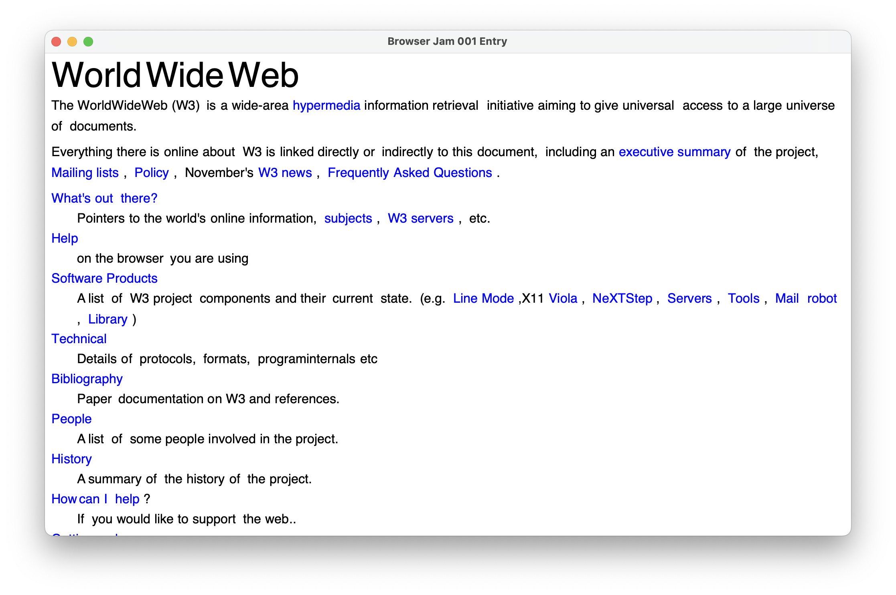

# Jelly Browser

## Building / Running

Simply run `cargo build` or `cargo run` in the root directory of the project. I
love rust.

## Lore

Jelly Browser was my attempt at writing a browser for [BrowserJam 1](https://github.com/BrowserJam/jam001) (get it?). Here's the
best result I was able to get within time:

## TODO
- Parse HTML in a spec-compliant way
- Implement CSS
- Fix layout engine
- Implement chrome
